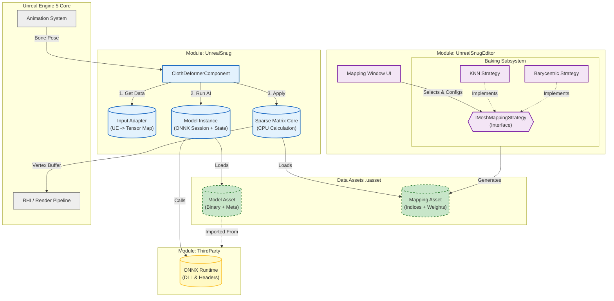
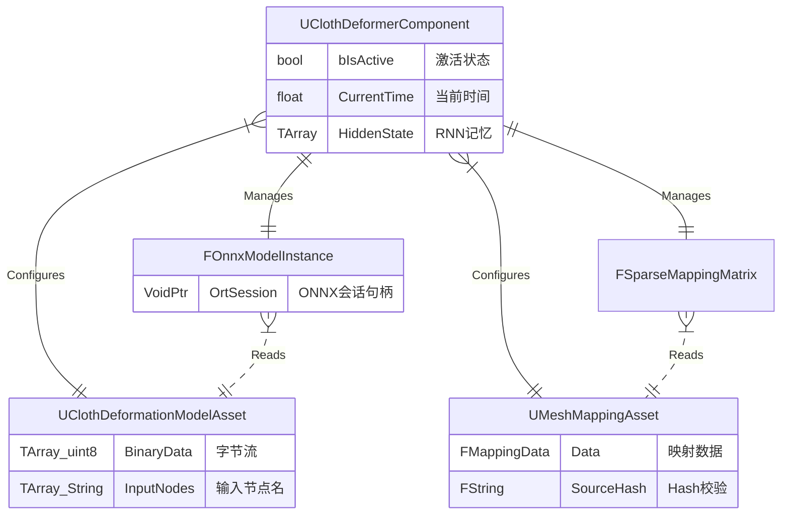
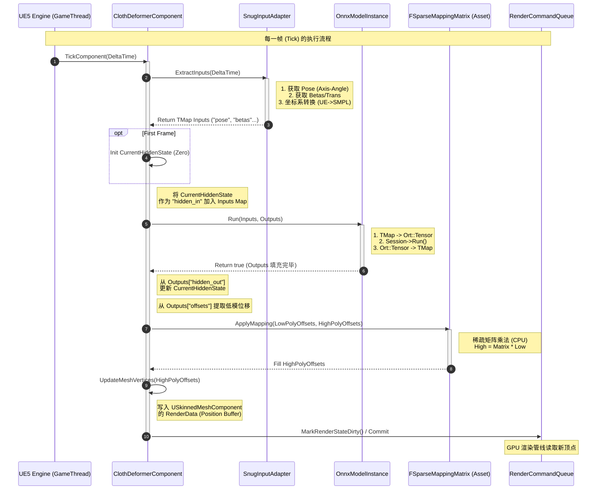

---
aliases:
domain:
tags:
modifiedDate: 2026/03/01, 13:25:01
---

# UE5 ClotheDeformer 插件系统设计

## 概要设计

### 架构模式

UE5 默认是模块化和分层的

### 技术选型

- UE5.6
- C++ 17
- 三方库 ONNX
- 映射算法 KD-Tree + KNN

### 模块划分

- `Editor Module` (负责烘焙映射) `UnrealSnugEditor`
- Runtime Module 运行时推理 `clothDeformerComponent`

### 架构图

>mermaid 代码, 浏览器中搜 mermaid

### 实体关系图

## 详细设计

### 时序图

### 类图

```mermaid
classDiagram
    %% =========================================================
    %% 1. Runtime Module (Runtime 模块 - 核心逻辑)
    %% =========================================================
    namespace Runtime_Module {

        %% [Component] 核心组件
        class UClothDeformerComponent {
            -TUniquePtr~FOnnxModelInstance~ modelInstance_
            -TUniquePtr~FInputAdapterBase~ InputAdapter
            +UClothDeformationModelAsset* modelAsset_
            +UMeshMappingAsset* MappingAsset
            -TArray~float~ CurrentHiddenState
            -int32 HiddenLayerSize
            +bool Initialize()
            +void TickComponent(float DeltaTime, ...)
            +bool RunInference(...)
            +void Reset()
        }

        %% [Adapter Base] 适配器基类
        class FInputDataAdapterBase {
            <<Abstract>>
            +Initialize(USkeletalMeshComponent*)*
            +TMap~FString, TArray_float~ ExtractInputs(float DeltaTime)*
            +Reset()*
        }

        %% [Snug Adapter] 具体适配器
        class FSnugInputAdapter {
            -TWeakObjectPtr~USkeletalMeshComponent~ SkelComp
            -TArray~int32~ CachedBoneIndices
            -TArray~FName~ TargetBoneNames
            +ExtractInputs(float DeltaTime) override
            -void ConvertBoneRotation(...)
        }

        %% [Instance] 模型推理实例
        class FOnnxModelInstance {
            -TUniquePtr~Ort::Session~ session_
            -TUniquePtr~Ort::Env~ env_
            +FOnnxModelInstance(UClothDeformationModelAsset*)
            +bool Run(const TArray~float~& Input, TArray~float~& Output)
            +bool Run(const TMap~Inputs~, TMap~Outputs~)
        }

        %% [Matrix Struct] 稀疏矩阵核心数据结构
        class FSparseMappingMatrix {
            <<Struct>>
            +TArray~int32~ RowPtr
            +TArray~int32~ ColIndice
            +TArray~float~ Value
            +void SetFromTriplet(...)
            +bool ApplyMapping(TArray~FVector~ In, TArray~FVector~ Out)
        }

        %% [Model Asset] ONNX 模型数据资产
        class UClothDeformationModelAsset {
            +TArray~uint8~ modelData_
            +TArray~FString~ inputNodeNames_
            +TArray~FString~ outputNodeNames_
            +void LoadModelData()
        }

        %% [Mapping Asset] 映射数据资产
        class UMeshMappingAsset {
            +FSparseMappingMatrix MappingData
        }
    }

    %% =========================================================
    %% 2. Editor Module (Editor 模块 - 工具与生产)
    %% =========================================================
    namespace Editor_Module {

        %% [UI] 烘焙工具窗口
        class SMeshMappingWindow {
            -TWeakObjectPtr~USkeletalMesh~ LowPolyMesh
            -TWeakObjectPtr~USkeletalMesh~ HighPolyMesh
            -TSharedPtr~IMeshMappingStrategy~ CurrentStrategy
            -TArray~TSharedPtr_IMeshMappingStrategy~ AvailableStrategies
            -TSharedPtr~SBox~ DynamicSettingsContainer
            +void Construct(const FArguments&)
            -FReply OnBakeClicked()
        }

        %% [Strategy Interface] 映射策略接口
        class IMeshMappingStrategy {
            <<Interface>>
            +FSparseMappingMatrix BuildMappingMatrix(...)*
            +bool GenerateMapping(..., UMeshMappingAsset* OutAsset)*
            +TSharedRef~SWidget~ CreateSettingsWidget()*
            +FString GetStrategyName()*
        }

        %% [KNN Strategy] 具体策略实现
        class FKnnMappingStrategy {
            -int32 k_
            +GenerateMapping(...) override
            +CreateSettingsWidget() override
        }
    }

    %% =========================================================
    %% 关系定义
    %% =========================================================

    %% --- Runtime 组合关系 ---
    UClothDeformerComponent *-- FInputDataAdapterBase : Owns (UniquePtr)
    UClothDeformerComponent *-- FOnnxModelInstance : Owns (UniquePtr)
    UClothDeformerComponent --> UClothDeformationModelAsset : References
    UClothDeformerComponent --> UMeshMappingAsset : References

    %% --- Adapter 继承 ---
    FInputDataAdapterBase <|-- FSnugInputAdapter : Inherits

    %% --- Data 依赖 ---
    FOnnxModelInstance ..> UClothDeformationModelAsset : Reads Data
    UMeshMappingAsset *-- FSparseMappingMatrix : Contains

    %% --- Editor 聚合与依赖 ---
    SMeshMappingWindow o-- IMeshMappingStrategy : Holds List
    FKnnMappingStrategy --|> IMeshMappingStrategy : Inherits
    
    %% --- Editor 生产 Runtime 资产 ---
    IMeshMappingStrategy ..> UMeshMappingAsset : Generates/Writes
    IMeshMappingStrategy ..> FSparseMappingMatrix : Builds
```

