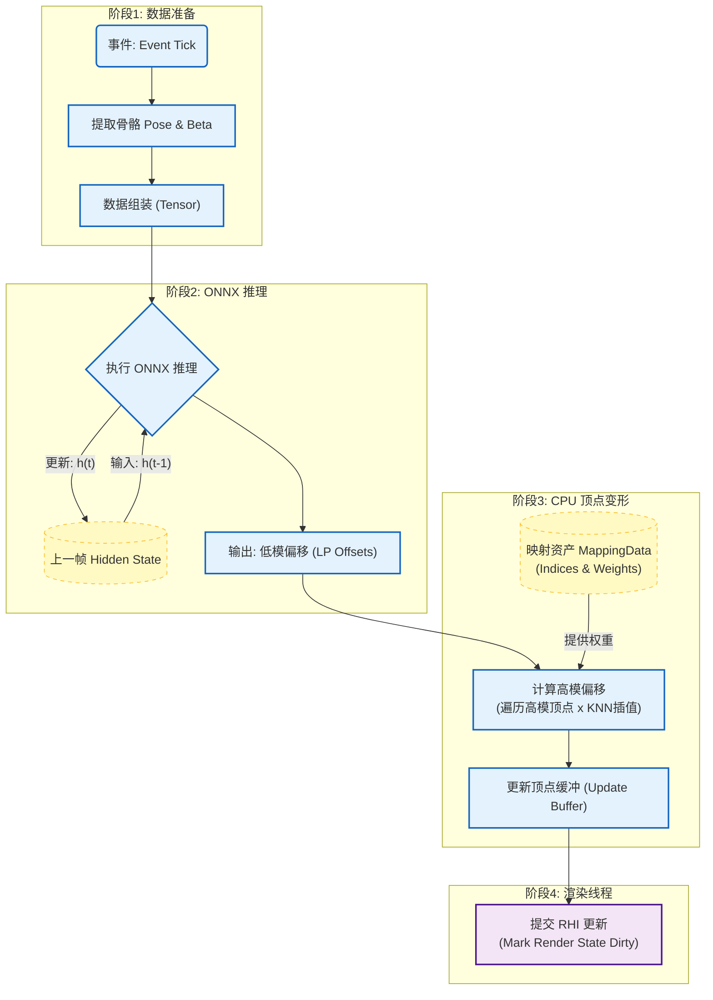
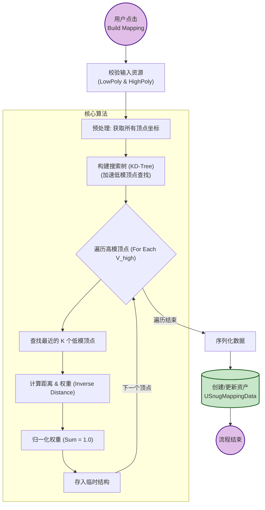

---
aliases:
created: 2026/04/01, 20:04:13
modifiedDate: 2026/05/10, 11:55:19
tags:
---

# 流程图

## 1 运行时

```mermaid
flowchart TD

    %% --- 定义样式 ---

    classDef logic fill:#e3f2fd,stroke:#1565c0,stroke-width:2px;

    classDef memory fill:#fff9c4,stroke:#fbc02d,stroke-dasharray: 5 5;

    classDef render fill:#f3e5f5,stroke:#4a148c,stroke-width:2px;

  

    %% --- 1. 输入阶段 ---

    subgraph Input_Stage [阶段1: 数据准备]

        Tick("事件: Event Tick") --> GetBone["提取骨骼 Pose & Beta"]

        GetBone --> Convert["数据组装 (Tensor)"]

    end

  

    %% --- 2. 推理阶段 ---

    subgraph Inference_Stage [阶段2: ONNX 推理]

        HiddenState[("上一帧 Hidden State")]

        Convert --> InferNode{"执行 ONNX 推理"}

        HiddenState -- "输入: h(t-1)" --> InferNode

        InferNode -- "更新: h(t)" --> HiddenState

        InferNode --> LPOffsets["输出: 低模偏移 (LP Offsets)"]

    end

  

    %% --- 3. 变形阶段 (CPU) ---

    subgraph Deform_Stage [阶段3: CPU 顶点变形]

        MappingAsset[("映射资产 MappingData\n(Indices & Weights)")]

        LPOffsets --> CalcHighPoly["计算高模偏移\n(遍历高模顶点 x KNN插值)"]

        MappingAsset -- "提供权重" --> CalcHighPoly

        CalcHighPoly --> UpdateBuffer["更新顶点缓冲 (Update Buffer)"]

    end

  

    %% --- 4. 渲染提交 ---

    subgraph Render_Stage [阶段4: 渲染线程]

        UpdateBuffer --> Commit["提交 RHI 更新\n(Mark Render State Dirty)"]

    end

  

    %% --- 样式应用 ---

    class Tick,GetBone,Convert,InferNode,LPOffsets,CalcHighPoly,UpdateBuffer logic;

    class HiddenState,MappingAsset memory;

    class Commit render;
```

## 数据准备

```mermaid
flowchart TD

    %% --- 样式 ---

    classDef user fill:#e1bee7,stroke:#4a148c,stroke-width:2px;

    classDef algo fill:#bbdefb,stroke:#0d47a1,stroke-width:2px;

    classDef data fill:#c8e6c9,stroke:#1b5e20,stroke-width:2px;

  

    Start(("用户点击\nBuild Mapping")):::user --> Check["校验输入资源\n(LowPoly & HighPoly)"]

    Check --> PreProcess["预处理: 获取所有顶点坐标"]

    subgraph Algorithm_Core [核心算法]

        PreProcess --> BuildTree["构建搜索树 (KD-Tree)\n(加速低模顶点查找)"]

        BuildTree --> LoopStart{"遍历高模顶点 (For Each V_high)"}

        LoopStart --> FindKNN["查找最近的 K 个低模顶点"]

        FindKNN --> CalcDist["计算距离 & 权重 (Inverse Distance)"]

        CalcDist --> Normalize["归一化权重 (Sum = 1.0)"]

        Normalize --> Store["存入临时结构"]

        Store -- "下一个顶点" --> LoopStart

    end

    LoopStart -- "遍历结束" --> Serialize["序列化数据"]

    Serialize --> CreateAsset[("创建/更新资产\nUSnugMappingData")]:::data

    CreateAsset --> End(("流程结束")):::user
```
