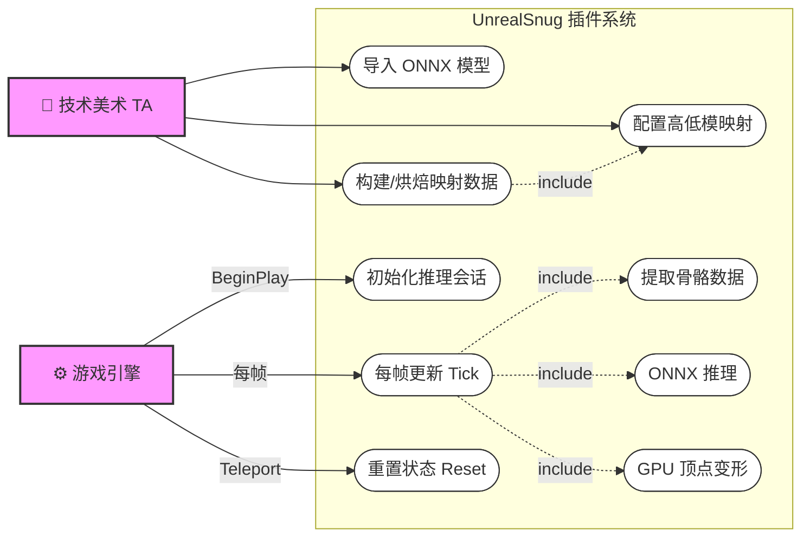

---
aliases:
tags:
modifiedDate: 2026/02/03, 00:02:40
---

# 用例图

```mermaid
graph LR

    %% 定义样式：让节点看起来像用例（椭圆）和角色（矩形或圆形）

    classDef actorStyle fill:#f9f,stroke:#333,stroke-width:2px;

    classDef usecaseStyle fill:#fff,stroke:#333,stroke-width:1px,rx:10,ry:10;

    classDef packageStyle fill:#eee,stroke:#333,stroke-width:2px,stroke-dasharray: 5 5;

  

    %% 角色 Actor

    TA[👤 技术美术 TA]:::actorStyle

    Engine[⚙️ 游戏引擎]:::actorStyle

  

    %% 系统边界 (System Boundary)

    subgraph UnrealSnug_System [UnrealSnug 插件系统]

        direction TB

        %% 编辑器功能

        UC_Import([导入 ONNX 模型]):::usecaseStyle

        UC_Config([配置高低模映射]):::usecaseStyle

        UC_Bake([构建/烘焙映射数据]):::usecaseStyle

        %% 运行时功能

        UC_Init([初始化推理会话]):::usecaseStyle

        UC_Tick([每帧更新 Tick]):::usecaseStyle

            UC_Extract([提取骨骼数据]):::usecaseStyle

            UC_Infer([ONNX 推理]):::usecaseStyle

            UC_Deform([GPU 顶点变形]):::usecaseStyle

        UC_Reset([重置状态 Reset]):::usecaseStyle

    end

  

    %% 连线关系

    TA --> UC_Import

    TA --> UC_Config

    TA --> UC_Bake

    UC_Bake -.->|include| UC_Config

  

    Engine -->|BeginPlay| UC_Init

    Engine -->|每帧| UC_Tick

    Engine -->|Teleport| UC_Reset

  

    %% 模拟 Include 关系

    UC_Tick -.->|include| UC_Extract

    UC_Tick -.->|include| UC_Infer

    UC_Tick -.->|include| UC_Deform
```
